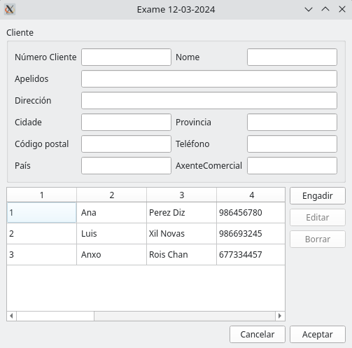

MANUAL
======

CLASE MODELO TABOA
------------------

Clase Modelo Taboa::

    class ModeloTaboa(QAbstractTableModel):
    def __init__(self, datos):
        super().__init__()
        self.datos = datos

    def rowCount(self, index):
        return len(self.datos)

    def columnCount(self, index):
        return len(self.datos[0])

    def data(self, index, role=Qt.ItemDataRole.DisplayRole):
        if index.isValid():
            if role == Qt.ItemDataRole.DisplayRole or role == Qt.ItemDataRole.EditRole:
                value = self.datos[index.row()][index.column()]
                return str(value)

    def setData(self, index, value, role):
        if role == Qt.ItemDataRole.EditRole:
            self.datos[index.row()][index.column()] = value
            return True
        return False

Esta clase hereda de **QAbstractTableModel** para crear el modelo al que se va asociar
la tabla.

CLASE FIESTRA PRINCIPAL
-----------------------
Tiene el contenido que se muestra en la ventana saliente cuando se ejecuta el programa.
El objetivo del programa es generar un informe con una tabla con datos asociados a la base de datos
de la tabla **Clientes**

METODOS DE CLASE FIESTA PRINCIPAL
^^^^^^^^^^^^^^^^^^^^^^^^^^^^^^^^^
Son los siguientes:

1. **on_btnEngadir_pressed(self):**
2. **on_btnEditar_pressed(self):**
3. **on_btnBorrar_pressed(self):**
4. **on_btnAceptar_pressed(self):**
5. **on_btnCancelar_pressed(self):**
6. **on_modelo_selectionChanged(self):**
7. **cargarCamposDendeSeleccion(self):**
8. **def borrarCampos(self):**
9. **on_botonGenerarFactura_clicked**

TABLA DEL FORMULARIO
--------------------

+----------+------------+------------+-------------+
|    1     |      2     |     3      |      4      |
+==========+============+============+=============+
| 1        | Ana        | Perez Diz  |  986857470  |
+----------+------------+------------+-------------+
| 2        | Luis       | Xil Novas  |  985628291  |
+----------+------------+------------+-------------+
| 3        | Anxo       | Rois Chan  |  6748294759 |
+----------+------------+------------+-------------+

IMAGEN DEL FORMULARIO
---------------------

LISTA DESORDENADA DE LA FICHA DEL CLIENTE
-----------------------------------------

- Número Cliente: 1
- Nome Cliente: Ana
- Apelidos: Pérez Díaz
- Direccion: Garcia Barbón
- Cidade: Vigo
- Provincia: Pontevedra
- Código postal: 36201
- Teléfono: 986456780
- País: España
- Axente Comercial: 1

MODULO CONEXIONBD
-----------------

METODOS DE CONEXION_BD
^^^^^^^^^^^^^^^^^^^^^^

**engadeRexistro**::

    def engadeRexistro(self, insertSQL, *parametros):
        """Realiza una inserción en la base de datos utilizando los parámetros especificados.

        :param insertSQL: Código de inserción SQL a ejecutar.
        :param *parametros: Parámetros para introducir en la inserción.

        """

        try:
            if self.conexion is None:
                print("Realizando inserción: É necesario realizar a conexión a base de datos previamente")
            else:
                if self.cursor is None:
                    print("Realizando inserción: É necesario realizar a creación do cursor previamente")
                else:
                    self.cursor.execute(insertSQL, parametros)
                    self.conexion.commit()

        except dbapi.DatabaseError as e:
            print("Erro facendo a inserción: " + str(e))
        else:
            print("Inserción executada")

**actualizaRexistro**::

    def actualizaRexistro(self, updateSQL, *parametros):
        """Realiza una actualización de registro en la base de datos utilizando los parámetros especificados.

        :param updateSQL: Código de actualización SQL a ejecutar.
        :param *parametros: Parámetros para introducir en la actualización.

        """

        try:
            if self.conexion is None:
                print("Realizando actualización rexistro: É necesario realizar a conexión a base de datos previamente")
            else:
                if self.cursor is None:
                    print("Realizando actualización rexistro: É necesario realizar a creación do cursor previamente")
                else:
                    self.cursor.execute(updateSQL, parametros)
                    self.conexion.commit()

        except dbapi.DatabaseError as e:
            print("Erro facendo a actualización rexistro: " + str(e))
        else:
            print("Actualización rexistro executada")

**borraRexistro**::

    def borraRexistro (self, borraSQL, *parametros):
        """Realiza un borrado de registro en la base de datos utilizando los parámetros especificados.

        :param borraSQL: Código de borrado SQL a ejecutar.
        :param *parametros: Parámetros para introducir en el borrado.

        """

        try:
            if self.conexion is None:
                print("Realizando borrado rexistro: É necesario realizar a conexión a base de datos previamente")
            else:
                if self.cursor is None:
                    print("Realizando borrado rexistro: É necesario realizar a creación do cursor previamente")
                else:
                    self.cursor.execute(borraSQL, parametros)
                    self.conexion.commit()
        except dbapi.DatabaseError as e:
                    print("Erro facendo o borrado rexistro: " + str(e))

        else:
            print("Borrado de rexistro executado")

CASO DE PRUEBA
--------------

**Nombre del caso de prueba:** Inserción de botón GenerarFactura.

**Descripción:** Este caso de prueba verifica si al pulsar el botón **GenerarFactura** crea un PDF con una tabla
que contenga los datos de los clientes de la base de datos.

**Pasos:**

1. Iniciar la aplicación.
2. Ejecutar el método **on_botonGenerarFactura_clicked**.
3. Verificar si se ha creado correctamente el PDF con los datos de la base de datos.

**Condiciones de ejecución:**

1. El PDF debe mostrar el formato de tabla indicado en el ejercicio 4.
2. Deben aparecer tantas tablas como clientes tiene la abse de datos con la información de cada uno.

**Resultado esperado:** Se espera la creación del PDF con la tablas y la información de cada cliente en ellas.

**Estado de prueba:** Realizado.

**Resultado obtenido:** Fallido.

**Errores asociados:** Se genera una tabla con todos los clientes en vez de una por cliente.

**Responsable do deseño de proba**: Jorge Amestoy

**Responsable da execución da proba**: Jorge Amestoy

**Comentarios**: Intentar ejecutar el método utilizando un **while** con el número de cliente.

